# Guía de estructura de archivos
## Para el directorio "/" (raiz del proyecto)

    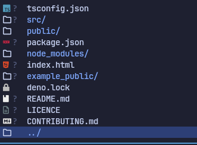

## Para el directorio "example_public" (eliminar ~~example_~~ public)

    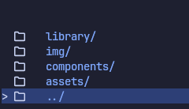

## Subdirectorios de "public"
* library

    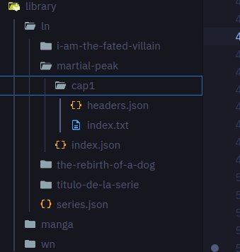

dentro del subdirectorio ln(light novel)

    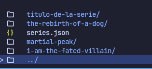

archivo series.json

    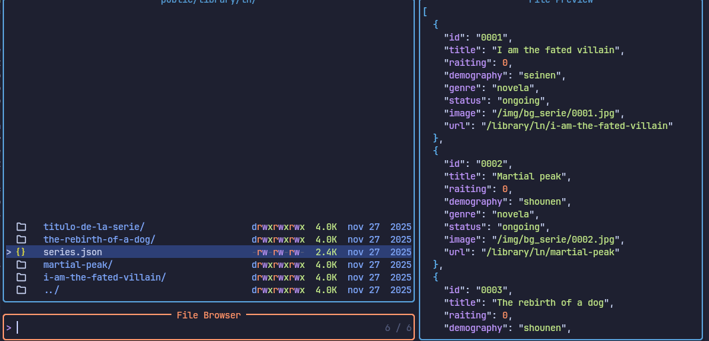

dentro del subdirectorio martial-peak

    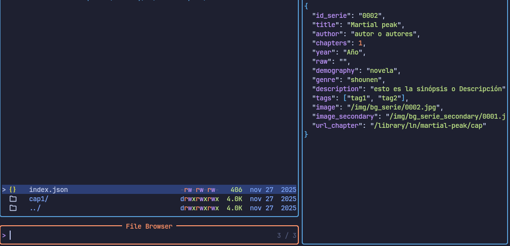

dentro de cap1 o cualquier "cap*"

    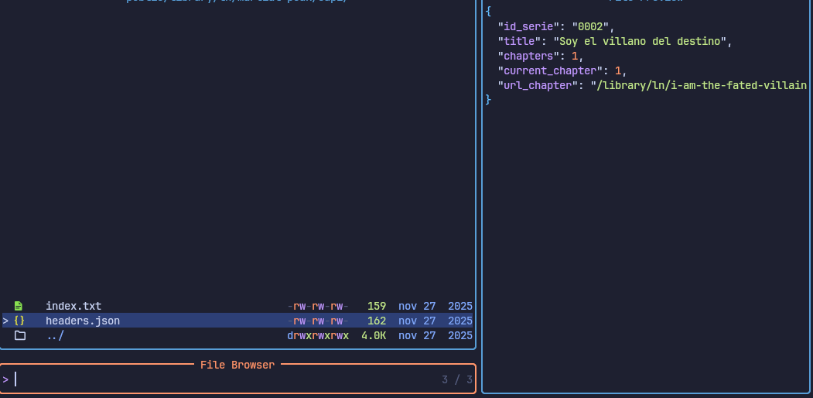

    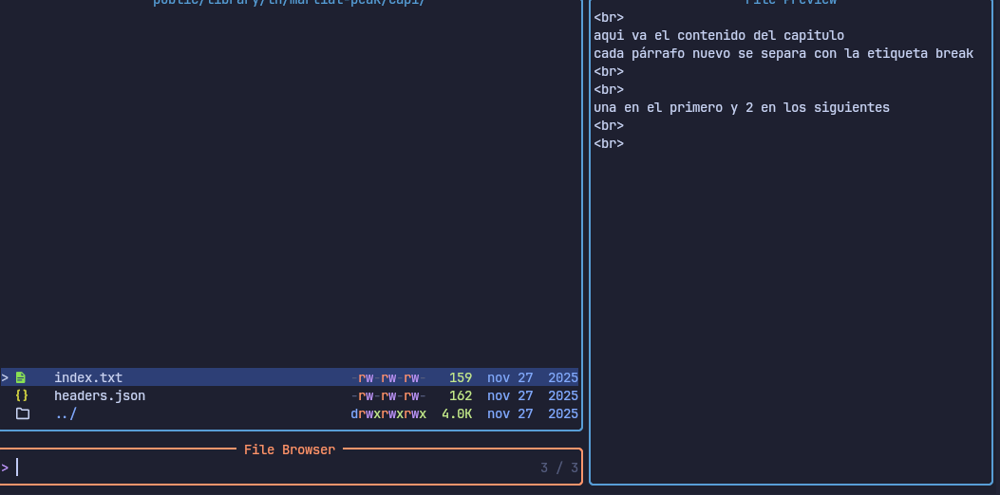

* img

    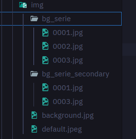

* components

    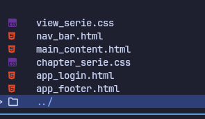

* assets

    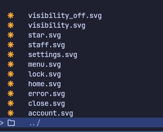

**NOTA**: Dentro de poco se tendrá una guía más detallada.
